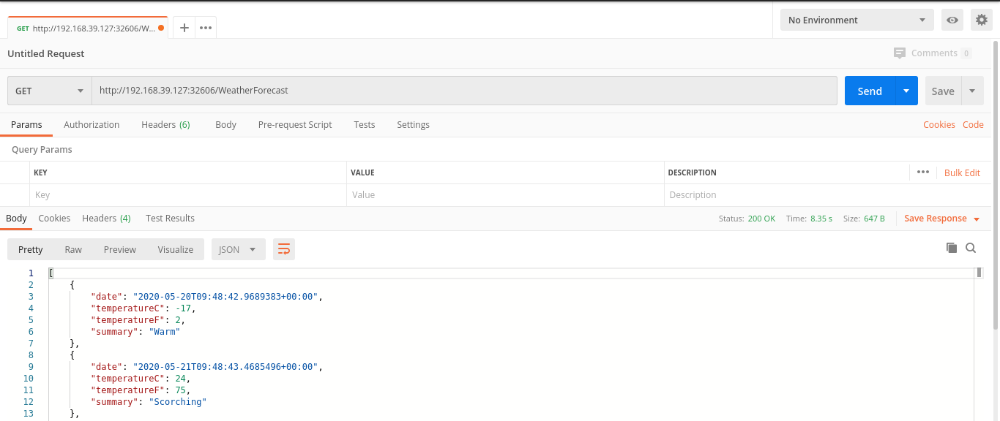

# Running a .Net Core Web API Service on Minikube

**Prerequisite**

* Linux machine with Minikube [Install Minikube](https://github.com/salman-mukhtar/setting-up-kubernetes-environment/blob/master/README.md)
* Visual studio code
* Docker
* Kubectl

**Setting up .Net Core Web API**

We can start with a .net core web api as an example. The application will run on Docker. To create it, we can proceed with the terminal command below.

```
dotnet new webapi -o WeatherAPI
```
This will create a project with necessory structure. Run the api by typing following on terminal.

```
dotnet run
```

Weather API will return random weather forcasting as shown below.

|  |
| ------------------------------------------------------------------- |

To dockerize the Web API application, we need the Dockerfile file, as you are familiar with, that we can encode it as follows.

```
FROM mcr.microsoft.com/dotnet/core/sdk:3.1 AS build-env
WORKDIR /app

# Copy csproj and restore as distinct layers
COPY WeatherAPI/*.csproj ./
RUN dotnet restore

# Copy everything else and build
COPY WeatherAPI/. ./
RUN dotnet publish -c Release -o out

# Build runtime image
FROM mcr.microsoft.com/dotnet/core/aspnet:3.1
WORKDIR /app
COPY --from=build-env /app/out .
ENTRYPOINT ["dotnet", "WeatherAPI.dll"]
```
**Docker Preparations**

After completing the dockerfile file, the web API application can be started to dockerize. After all, Minikube's main task is to provide orchestration of dockerized samples. For dockerize process, it will be enough to use the build command as follows.

```
docker build -t weather-api .
```
|  |
| ------------------------------------------------------------------- |

After the Docker image is ready, the required distribution process can be started for the minikube. In this note, we use the kubectl command line tool. kubectl will perform a deployment process using the contents of the deployment.yaml file. 

**Minikube Deployment Preparations**

First of all we create a deployment file to run our pods on Minikube. The deployment file will look as follows.

```
apiVersion: apps/v1
kind: Deployment
metadata:
  name: weather-api
spec:
  selector:
    matchLabels:
      app: weather-api
  replicas: 1
  template:
    metadata:
      labels:
        app: weather-api
    spec:
      containers:
        - name: weather-api
          imagePullPolicy: Never
          image: weather-api
          resources:
            limits:
              memory: "50Mi"
              cpu: "50m"
            requests:
              memory: "20Mi"
              cpu: "20m"
          ports:
          - containerPort: 80
```

We can perform these operations with the following terminal commands. Before starting these operations, I would like to remind you that minikube service must be running. Now we apply our deployment.

```
kubectl create -f deployment.yaml
```

|  |
| ------------------------------------------------------------------- |

```
kubectl get deployments
kubectl get pods
```

|  |
| ------------------------------------------------------------------- |

If you look at the above image, after running the deployment we get an error for pods that is "ErrImageNewPull". The problem was that the minikube and the docker were not aware of each other. To overcome the problem, it is necessary to use the eval command and then re-create the docker image and redistribute it to the minikube. Of course, due to previous commands, there will probably be distributions that stop in the system. You have to delete them first. We can find the distribution package with the first command below and then delete it.

```
kubectl delete deployment weather-api
```

After the cleaning is completed, we can proceed with the following commands. The first command provides the setting of the local environment parameters necessary to run the docker in the minikube instance. 

```
eval $(minikube docker-env)
```

Afterwards are about creating the image of the docker and distributing it to the minikube environment.

```
docker build -t weather-api .
kubectl create -f deployment.yaml
```

Check the deployment and pods again.

```
kubectl get deployments
kubectl get pods
```

|  |
| ------------------------------------------------------------------- |

**Testing out deployment**

As you can see our dockerized service currently live in the Minikube environment. Now we expose the deployment as NodePort to it to be accessed.

```
kubectl expose deployment weather-api --type=NodePort
```

After the service is exposed, get the url for the running service

```
minikube service weather-api --url
```

|  |
| ------------------------------------------------------------------- |

I am using postman to test the service. If you copy the link from above command and paste it in postman, you will see the result. Our containerized web api is running successfully.

|  |
| ------------------------------------------------------------------- |


